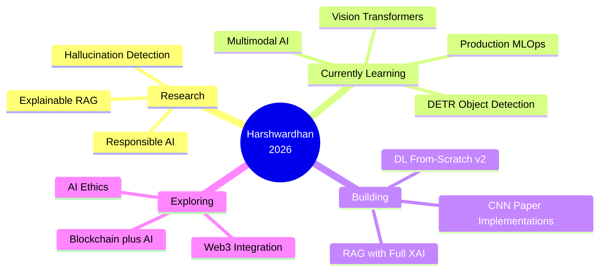

<div align="center">

<!--═══════════════════════════════════════════════════════════
  HEADER — capsule-render waving (proven working)
═══════════════════════════════════════════════════════════-->


<!-- Primary typing SVG — demolab is reliable -->


<br/><br/>

<!-- Badges row -->
<a href="https://github.com/Eleutherian13"></a>
<a href="https://github.com/Eleutherian13?tab=stars"></a>
<a href="https://www.linkedin.com/in/harshwardhhan-tiwari-078b1a375/"></a>
<a href="mailto:tiwariharshwardhhan@gmail.com"></a>


<br/><br/>

<!-- Status typing -->


</div>


<br/>

---

<div align="center">

</div>

<br/>

```yaml
# identity.yaml
name         : Harshwardhan Tiwari
alias        : Eleutherian13          # Greek — "one who brings freedom"
based_in     : India 🇮🇳  |  Remote-ready
role         : AI / ML Engineer  ·  MERN Stack Developer

core_skills  :
  ml_dl        : Python · NumPy · PyTorch · TensorFlow · Keras · Scikit-learn
  transformers : Attention mechanisms · Transformer architecture · HuggingFace
  rag_llm      : LangChain · FAISS · BM25 · Hallucination detection · RAG pipelines
  mern_stack   : MongoDB · Express.js · React.js · Node.js · REST APIs · JWT
  fundamentals : Backprop from scratch · CNNs from papers · ML from linear algebra

currently_learning :
  - Computer Vision (YOLO · DETR · OpenCV)
  - Vision Transformers (ViT · Swin)
  - Multimodal AI systems
  - Production MLOps

competition  : IIT-R DataForge Top-4  ·  IIT-R Productathon Top Finisher
streak       : 100+ day GitHub streak (and still going 🔥)
honest_note  : Some hackathon projects are vibe-coded — that's real!

philosophy   : "Never a black box — understand, build, explain."
goal         : Contribute to transparent and trustworthy AI
status       : Open to collaborations · AI roles · Research
```

<br/>

---

<div align="center">

</div>

<br/>

> *"The best way to understand something is to build it from scratch."*
> — **Harshwardhan Tiwari**

<br/>

<div align="center">

<!-- Rotating quotes typing animation -->


</div>

<br/>

<div align="center">

| | |
|:---:|:---|
| 💜 | *"Any fool can write code that a computer can understand. Good programmers write code that humans can understand."* — **Martin Fowler** |
| 🧠 | *"The measure of intelligence is the ability to change."* — **Albert Einstein** |
| 🔥 | *"First, solve the problem. Then, write the code."* — **John Johnson** |
| 🚀 | *"In theory there is no difference between theory and practice. In practice there is."* — **Yogi Berra** |
| 🌱 | *"It's not that I'm so smart, it's just that I stay with problems longer."* — **Albert Einstein** |

</div>

<br/>

---

<div align="center">

</div>

<br/>

I'm not a typical ML engineer who treats models as black boxes. I go deeper — deriving gradients manually, implementing backpropagation from scratch with NumPy, rebuilding legendary CNN architectures from their original papers. Alongside that, I build production-grade full-stack apps with the MERN stack. Some things are vibe-coded and experimental (that's honest), but my core work is always built to be understood and explained.

🔬 **Research interest** — Hallucination detection · Explainable RAG · Responsible AI  
⚙️ **Build style** — First principles first, then production  
🎯 **Currently learning** — Computer Vision · Vision Transformers · Multimodal AI  
🏆 **Competition validated** — IIT-R DataForge · Productathon Top Finisher

<br/>

---

<div align="center">

</div>

<br/>

<div align="center">

### Languages


### AI · ML · Deep Learning


&nbsp;


### MERN Stack · Full-Stack


&nbsp;


### Tools · DevOps


</div>

<br/>

---

<div align="center">

</div>

<br/>

### 🤖 AI & Machine Learning

<table>
<tr>
<td width="50%" valign="top">

### 🏆 [Hallucination Hunter](https://github.com/Eleutherian13/hallucination-hunter)

> *IIT E-Summit '26 DataForge — 4th Place, Judge's Favourite Code*

LLM hallucination detection and correction system — my most complete AI project to date. Built a hybrid retrieval pipeline with NLI-based claim verification.

```
F1 Score  : 0.89+ on benchmarks
Retrieval : FAISS dense + BM25 sparse
Verify    : NLI cross-encoder pipeline
Deploy    : FastAPI backend + Streamlit UI
```

[](https://github.com/Eleutherian13/hallucination-hunter)
`Python` `Apache 2.0`

</td>
<td width="50%" valign="top">

### 💡 [Explainable RAG](https://github.com/Eleutherian13/Explainable-Rag)

> *"Don't just answer — show me WHY."*

A RAG pipeline built around transparency — full source attribution, reasoning chain exposure, and per-answer confidence scoring. No black box outputs.

```
Citations  : Full document lineage
Reasoning  : Chain-of-thought exposed
Confidence : Per-answer scoring
Trust      : Earned, not assumed
```

[](https://github.com/Eleutherian13/Explainable-Rag)
`Python` `LangChain`

</td>
</tr>

<tr>
<td width="50%" valign="top">

### 🔬 [DL From Scratch](https://github.com/Eleutherian13/DL-From-Scratch)

> *Pure mathematics → working neural networks*

Deep learning with nothing but NumPy. Every forward pass, every backward pass, every optimizer — derived from first principles. Built to understand, not to show off.

```
Tools     : NumPy only (that's it)
Covers    : NNs · CNNs · Backprop
           Activations · Optimizers
Goal      : Real understanding
```

[](https://github.com/Eleutherian13/DL-From-Scratch)
`Jupyter Notebook`

</td>
<td width="50%" valign="top">

### 🤖 [ML From Scratch](https://github.com/Eleutherian13/ML-From-Scratch)

> *Zero sklearn. Pure linear algebra and stats.*

Classic ML algorithms rebuilt entirely from mathematics. Not because it's faster — because you can't truly understand something you haven't built.

```
Covers : Linear / Logistic Regression
         Decision Trees (ID3, CART)
         k-NN · k-Means · PCA · SVD
         Naive Bayes · SVM
```

[](https://github.com/Eleutherian13/ML-From-Scratch)
`Python` `Jupyter`

</td>
</tr>

<tr>
<td width="50%" valign="top">

### 🖼️ [CNN Research Papers](https://github.com/Eleutherian13/CNN-s-implementation-of-Research-Papers-)

> *Reading papers is easy. Reimplementing them is mastery.*

Rebuilt landmark CNN architectures directly from their original papers using TensorFlow/Keras — not tutorials, not YouTube walkthroughs.

```
LeNet-5   (1998) — The original CNN
AlexNet   (2012) — ImageNet revolution
VGG-16/19 (2014) — Depth matters
```

[](https://github.com/Eleutherian13/CNN-s-implementation-of-Research-Papers-)
`TensorFlow` `Keras` `MIT`

</td>
<td width="50%" valign="top">

### 👁️ [Object Detection](https://github.com/Eleutherian13/Object-Detection-)

> *Understanding YOLO beyond just running it*

Learning object detection from the ground up — grid cells, anchor boxes, NMS, custom training pipelines. Currently deepening CV knowledge here.

```
YOLO v5/v8  Architecture study
Custom      Training pipelines
Evaluation  mAP@0.5 · IoU
Internals   Anchors · NMS · Loss
```

[](https://github.com/Eleutherian13/Object-Detection-)
`PyTorch` `OpenCV`

</td>
</tr>
</table>

<br/>

### 💼 Full-Stack · MERN

<table>
<tr>
<td width="50%" valign="top">

### 🎓 [IntelliLead Hub](https://github.com/Eleutherian13/intellilead-hub)

AI-powered lead management system with scoring, analytics dashboard, and CRM integrations. `React · Node · Express · AI APIs`

[](https://github.com/Eleutherian13/intellilead-hub)

</td>
<td width="50%" valign="top">

### 🛍️ [E-Commerce Backend](https://github.com/Eleutherian13/E-Com-Web-Application-)

Full production backend — JWT auth, cart, orders, payments — built in a single coding session. `Node · Express · MongoDB`

[](https://github.com/Eleutherian13/E-Com-Web-Application-)

</td>
</tr>
<tr>
<td width="50%" valign="top">

### 🌐 [Explainable RAG v2](https://github.com/Eleutherian13/Explainable-Rag-v2)

Web-based version with real-time explainability UI. `React · Node · LangChain`

[](https://github.com/Eleutherian13/Explainable-Rag-v2)

</td>
<td width="50%" valign="top">

### 🔍 [ML Learning Lab](https://github.com/Eleutherian13/ML-Learning)

My public study journal — annotated notebooks and experiments. `Python · Scikit-Learn`

[](https://github.com/Eleutherian13/ML-Learning)

</td>
</tr>
</table>

<br/>

---

<div align="center">

</div>

<br/>

<div align="center">

| 🏅 | Event | Result | Year |
|:---:|:---|:---|:---:|
| 🥇 | IIT-R E-Summit DataForge — Hallucination Detection Track | **4th Place · Judge's Favourite Code · F1 = 0.89+** | 2026 |
| 🏅 | IIT-R Productathon | **Top Finisher** | 2026 |
| 🚀 | HackNNDD-26 Hackathon | Competed & Shipped | 2026 |
| 🔥 | GitHub Commit Streak | **100+ Days — Unbroken** | 2026 |

</div>

<div align="center">
<a href="https://github.com/Eleutherian13/hallucination-hunter"></a>
<a href="https://github.com/Eleutherian13/IITR-productathon"></a>
<a href="https://github.com/Eleutherian13/hacknndd-26"></a>
</div>

<br/>

---

<div align="center">

</div>

<br/>

<div align="center">

<!-- STREAK — demolab is reliable, dark bg -->


<br/><br/>

<!-- STATS — vercel app, most reliable -->


<br/><br/>

<!-- ACTIVITY GRAPH — vercel, reliable -->


<br/><br/>

<!-- TROPHIES — tokyonight theme, no-bg so works on both white/dark -->


<br/><br/>

<!-- SNAKE — works only after Actions workflow is configured -->
<!-- Setup guide: https://github.com/Platane/snk#usage-github-actions -->

<br/>
<picture>
  <source media="(prefers-color-scheme: dark)"
    srcset="https://raw.githubusercontent.com/Eleutherian13/Eleutherian13/output/github-contribution-grid-snake-dark.svg">
  <source media="(prefers-color-scheme: light)"
    srcset="https://raw.githubusercontent.com/Eleutherian13/Eleutherian13/output/github-contribution-grid-snake.svg">
  
</picture>

</div>

<br/>

---

<div align="center">

</div>

<br/>



<br/>

<div align="center">

| | | |
|:---:|:---|:---|
| 🔭 | Implementing now | Vision Transformers (ViT), DETR from papers |
| 🌱 | Actively learning | Multimodal AI, Production ML, Advanced CV |
| 👯 | Open to | Research collabs, AI engineering roles, mentorship |
| 💬 | Ask me about | Explainable AI, RAG, DL from scratch, MERN |
| 🎯 | Long-term goal | Make AI transparent and trustworthy for everyone |
| 📫 | Email | tiwariharshwardhhan@gmail.com |
| ⚡ | Honest fact | Some of my projects are vibe-coded — and that's okay |

</div>

<br/>

---

<div align="center">

</div>

<br/>

```
2026 ══════════════════════════════════════════════════════════════

  ◉  [Q1]  🥇  IIT-R E-Summit DataForge — 4th Place
  │             Hallucination Hunter · F1 = 0.89+
  │             Hybrid RAG · NLI Verification · FastAPI
  │             Singled out by judges for code quality
  │
  ◉  [Q1]  🏅  IIT-R Productathon — Top Finisher
  │             Full AI product shipped under competition pressure
  │
  ◉  [Q1]  🔬  Explainable RAG — Deployed
  │             Source attribution + reasoning transparency
  │
  ◉  [Q1]  🖼️  CNN Research Papers — Complete
  │             LeNet-5 · AlexNet · VGG-16/19
  │             Rebuilt from original papers, not tutorials
  │
  ◉  [Q1]  📚  DL + ML From-Scratch Library — Built
  │             Neural nets, CNNs, optimizers — pure NumPy
  │
  ◉  [NOW] 🔥  100+ Day GitHub Streak — Unbroken
                Consistency over motivation, every day

══════════════════════════════════════════════════════════════════
```

<br/>

---

<div align="center">

</div>

<br/>

```python
class HarshwardhanTiwari:
    """
    AI / ML Engineer · MERN Developer · First-Principles Learner
    """

    stack = ["Python", "ML/DL", "Transformers", "MERN", "Git"]

    principles = {
        "understanding"    : "Deep mastery over surface knowledge",
        "transparency"     : "Explainable AI > black-box AI",
        "first_principles" : "Build from mathematics, zero shortcuts",
        "honesty"          : "Some things are vibe-coded — and that's fine",
        "open_source"      : "Share freely — knowledge compounds",
        "consistency"      : "100+ commit days — habit beats motivation",
    }

    def approach(self, problem):
        steps = [
            "Break it to fundamentals",
            "Derive the mathematics",
            "Implement from scratch",
            "Make it explainable",
            "Open source it",
        ]
        return f"Solved: {problem!r} — honestly and rigorously"
```

<br/>

---

<div align="center">


<br/>


<br/><br/>

<a href="https://github.com/Eleutherian13"></a>
<a href="https://www.linkedin.com/in/harshwardhhan-tiwari-078b1a375/"></a>
<a href="mailto:tiwariharshwardhhan@gmail.com"></a>
<a href="https://twitter.com/Eleutherian13"></a>

<br/><br/>


<br/><br/>


<br/>

<!-- FOOTER WAVE — same service as header, guaranteed to work -->


<br/>


</div>

<!--
═══════════════════════════════════════════════════════════
  SNAKE SETUP NOTE (one-time):
  To enable the contribution snake animation, add this file
  to your Eleutherian13/Eleutherian13 repo:

  .github/workflows/snake.yml
  ───────────────────────────
  name: Generate Snake
  on:
    schedule: [{ cron: "0 0 * * *" }]
    workflow_dispatch:
  jobs:
    snake:
      runs-on: ubuntu-latest
      steps:
        - uses: Platane/snk@v3
          with:
            github_user_name: ${{ github.repository_owner }}
            outputs: |
              dist/github-contribution-grid-snake.svg
              dist/github-contribution-grid-snake-dark.svg?palette=github-dark
        - uses: crazy-max/ghaction-github-pages@v3
          with:
            target_branch: output
            build_dir: dist
          env:
            GITHUB_TOKEN: ${{ secrets.GITHUB_TOKEN }}
═══════════════════════════════════════════════════════════
-->
