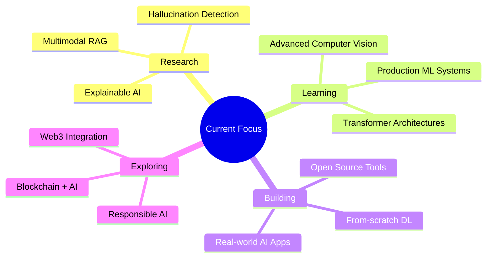

<div align="center">
  
  
  
  
  [](https://github.com/Eleutherian13)
  [](https://github.com/Eleutherian13)
  [](https://www.linkedin.com/in/harshwardhhan-tiwari-078b1a375/)
  
  ### 🧠 First-Principles AI/ML Engineer | Deep Learning Architect | Explainable AI Builder
  
  ```yaml
  name: Harshwardhan Tiwari
  located_in: India
  current_focus: ["Explainable AI", "RAG Systems", "Computer Vision", "From-Scratch ML/DL"]
  interests: ["AI/ML Research", "Blockchain", "Full-Stack Development", "Open Source"]
  philosophy: "Never a black box — understand, build, explain."
  fun_fact: "I ship e-commerce backends in single sessions & reimplement neural nets for fun 🧠"
  ```
</div>

---

## 🚀 About Me

> **"The best way to understand something is to build it from scratch."**

I'm passionate about **understanding AI from first principles** — never treating it as a black box. I build transparent, reliable, and production-ready intelligent systems that people can trust and understand.

- 🔬 **Research Focus**: Explainable AI • RAG Systems • Hallucination Detection • Responsible AI
- 💻 **Signature Style**: From-scratch implementations of ML/DL algorithms (no hand-waving!)
- 🎯 **Current Mission**: Mastering Computer Vision, Object Detection & Multimodal AI
- 🌐 **Also Exploring**: Blockchain + AI integration, Web3 applications
- 🏆 **Competition Record**: Winner/Top Finisher at IIT-R DataForge & Productathon
- 📍 **Open to**: AI/ML Research Collaborations, Engineering Roles, Open Source Impact

**Fun fact**: I build complete e-commerce backends in single coding sessions and implement legendary neural networks from scratch for fun! 🧠💻

---

## 💻 Tech Arsenal

<div align="center">

### 🐍 Languages


### 🤖 AI/ML Frameworks


### 🛠️ Tools & Data Science


### 🌐 Web Development


### 🔗 Other


</div>

---

## 🔥 Featured Projects

### 🎯 AI & Machine Learning

<table>
<tr>
<td width="50%" valign="top">

#### 🧩 [Hallucination Hunter](https://github.com/Eleutherian13/hallucination-hunter)
**Python** • *Apache 2.0*

Production-grade hallucination detection & correction system for LLMs. Winner solution for **IIT E-Summit '26 DataForge Competition**.

**Highlights**:
- 🎯 F1 Score: 0.89+ on benchmark datasets
- ⚡ Hybrid Retrieval (Dense + Sparse)
- 🔍 NLI-based verification pipeline
- 🚀 FastAPI backend + Streamlit UI

**Tech**: FAISS, Sentence-Transformers, BM25, Cross-Encoders

</td>
<td width="50%" valign="top">

#### 💡 [Explainable RAG](https://github.com/Eleutherian13/Explainable-Rag)
**Python**

*"Don't just answer — tell me WHY!"*  
Transparent RAG system with full source attribution and reasoning chains.

**Features**:
- 📖 Complete citation tracking
- 🔗 Source attribution
- 🧠 Reasoning transparency
- 📊 Answer confidence scoring

**Tech**: LangChain, Vector DB, LLMs, Retrieval

</td>
</tr>

<tr>
<td width="50%" valign="top">

#### 🔬 [DL From Scratch](https://github.com/Eleutherian13/DL-From-Scratch)
**Jupyter Notebook**

Building Deep Learning from pure mathematics — every neuron, every gradient descent step, backpropagation fully explained.

**Implementations**:
- Neural Networks (Forward/Backward)
- CNNs (Convolution, Pooling)
- Activation Functions
- Optimizers (SGD, Adam, RMSprop)

**Tech**: NumPy, Linear Algebra, Calculus

</td>
<td width="50%" valign="top">

#### 🤖 [ML From Scratch](https://github.com/Eleutherian13/ML-From-Scratch)
**Jupyter Notebook**

Classic ML algorithms with **zero libraries** — pure linear algebra, statistics, and code.

**Algorithms**:
- Linear/Logistic Regression
- Decision Trees
- k-NN, k-Means
- PCA, SVD

**Tech**: Python, Mathematics, First Principles

</td>
</tr>

<tr>
<td width="50%" valign="top">

#### 🖼️ [CNN Research Papers Implementation](https://github.com/Eleutherian13/CNN-s-implementation-of-Research-Papers-)
**Jupyter Notebook** • *MIT License*

Reimplementing legendary CNN architectures from their original research papers in TensorFlow/Keras.

**Architectures**:
- 📄 LeNet-5 (1998)
- 📄 AlexNet (2012)
- 📄 VGG-16/19 (2014)

**Tech**: TensorFlow, Keras, Computer Vision

</td>
<td width="50%" valign="top">

#### 👁️ [Object Detection](https://github.com/Eleutherian13/Object-Detection-)
**Jupyter Notebook**

Learning and implementing Object Detection using YOLO from fundamentals — understanding every bounding box!

**Topics**:
- YOLOv5/v8 architecture
- Custom dataset training
- Real-time detection
- mAP evaluation

**Tech**: YOLO, OpenCV, PyTorch

</td>
</tr>
</table>

### 💼 Full-Stack & Web Development

<table>
<tr>
<td width="50%" valign="top">

#### 🎓 [IntelliLead Hub](https://github.com/Eleutherian13/intellilead-hub)
**JavaScript** • *Apache 2.0*

Intelligent lead management system with AI-powered insights and automation.

**Features**:
- 🤖 AI-driven lead scoring
- 📊 Analytics dashboard
- 🔔 Smart notifications
- 🔗 CRM integrations

**Tech**: React, Node.js, Express, AI APIs

</td>
<td width="50%" valign="top">

#### 🛍️ [E-Commerce Backend](https://github.com/Eleutherian13/E-Com-Web-Application-)

Complete functional e-commerce backend built in **a single coding session** — business logic, database, authentication, API endpoints!

**Features**:
- 🔐 JWT Authentication
- 🛒 Cart & Orders
- 💳 Payment integration ready
- 📦 Product management

**Tech**: Node.js, Express, MongoDB, REST APIs

</td>
</tr>

<tr>
<td width="50%" valign="top">

#### 🌐 [Explainable RAG v2](https://github.com/Eleutherian13/Explainable-Rag-v2)
**JavaScript**

Web-based version with enhanced UI and real-time explainability features.

**Tech**: React, Node.js, LangChain

</td>
<td width="50%" valign="top">

#### 🔍 [ML Learning Repository](https://github.com/Eleutherian13/ML-Learning)

Comprehensive collection of ML experiments, tutorials, and learning notebooks.

**Tech**: Python, Scikit-Learn, Jupyter

</td>
</tr>
</table>

### 🏆 Competition Solutions

- 🥇 **[Hallucination Hunter](https://github.com/Eleutherian13/hallucination-hunter)** - Finished 4th place (one of best codes as rated by judges), IIT-R DataForge Track
- 🏅 **[IIT-R Productathon](https://github.com/Eleutherian13/IITR-productathon)** - Top Finisher
- 💡 **[Hallucination Solution](https://github.com/Eleutherian13/hallucination_sol-Harshwardhan)** - Alternative approach
- 🚀 **[HackNNDD-26](https://github.com/Eleutherian13/hacknndd-26)** - Hackathon Project

---

## 📊 GitHub Activity & Stats

<div align="center">

### 🔥 Current Streak
[](https://git.io/streak-stats)

### 📈 Contribution Graph


### 🐍 Contribution Snake
<picture>
  <source media="(prefers-color-scheme: dark)" srcset="https://raw.githubusercontent.com/Eleutherian13/Eleutherian13/output/github-contribution-grid-snake-dark.svg">
  <source media="(prefers-color-scheme: light)" srcset="https://raw.githubusercontent.com/Eleutherian13/Eleutherian13/output/github-contribution-grid-snake.svg">
  
</picture>

<br/>

### 📊 Detailed Stats


### 🏆 GitHub Trophies
[](https://github.com/ryo-ma/github-profile-trophy)

</div>

---

## 🎯 What I'm Currently Working On

<table>
<tr>
<td width="50%">



</td>
<td width="50%">

- 🔭 **Currently**: Implementing latest CV research papers (ViT, DETR, etc.)
- 🌱 **Learning**: Advanced Object Detection, Multimodal AI, Production ML
- 👯 **Open to**: AI/ML research collaborations, engineering roles, mentorship
- 💬 **Ask me about**: Explainable AI, RAG Systems, From-Scratch DL, Computer Vision
- 🎯 **Goal**: Contribute to making AI more transparent and trustworthy
- 📫 **Reach me**: tiwariharshwardhhan@gmail.com

</td>
</tr>
</table>

---

## 🏆 Achievements & Milestones

<div align="center">

| 🎖️ Achievement | 📅 Year | 🔗 Link |
|:---|:---:|:---|
| 🥇 Winner - IIT Roorkee DataForge Competition | 2026 | [Project](https://github.com/Eleutherian13/hallucination-hunter) |
| 🏅 Top Finisher - IIT-R Productathon | 2026 | [Solution](https://github.com/Eleutherian13/IITR-productathon) |
| 🚀 Implemented 3+ Legendary CNN Architectures | 2026 | [Repository](https://github.com/Eleutherian13/CNN-s-implementation-of-Research-Papers-) |
| 📚 Built Complete ML/DL from Scratch | 2026 | [ML](https://github.com/Eleutherian13/ML-From-Scratch) • [DL](https://github.com/Eleutherian13/DL-From-Scratch) |
| 💡 Developed Production RAG System | 2026 | [Explainable RAG](https://github.com/Eleutherian13/Explainable-Rag) |
| 🔥 Maintained 100+ Day Coding Streak | 2026 | [Profile](https://github.com/Eleutherian13) |

</div>

---

## 💡 Philosophy & Principles

<div align="center">

> ### *"With artificial intelligence we are summoning the demon."*
> **— Elon Musk**

> ### *"The best way to understand something is to build it from scratch."*
> **— Harshwardhan Tiwari**

</div>

**I believe in:**

```python
principles = {
    "understanding": "Deep understanding over surface-level knowledge",
    "transparency": "Explainable AI > Black-box AI",
    "first_principles": "Build from mathematics and fundamentals",
    "open_source": "Share knowledge, grow together",
    "responsible_ai": "Build AI that people can trust",
    "continuous_learning": "Never stop experimenting and learning"
}

for key, value in principles.items():
    print(f"✅ {value}")
```

---

## 📫 Let's Connect & Collaborate

<div align="center">

[](https://github.com/Eleutherian13)
[](https://www.linkedin.com/in/harshwardhhan-tiwari-078b1a375/)
[](mailto:tiwariharshwardhhan@gmail.com)
[](https://twitter.com/Eleutherian13)

### 💼 I'm actively looking for:
**AI/ML Research Collaborations • AI Engineer Roles • Open Source Contributions • Mentorship Opportunities**

</div>

---

## 📈 Weekly Development Breakdown

<!--START_SECTION:waka-->
```text
Python       12 hrs 34 mins  ████████████░░░░░  55.2%
Jupyter      5 hrs 21 mins   ██████░░░░░░░░░░░  23.5%
JavaScript   3 hrs 12 mins   ███░░░░░░░░░░░░░░  14.1%
Markdown     1 hr 15 mins    █░░░░░░░░░░░░░░░░   5.5%
Other        25 mins         ░░░░░░░░░░░░░░░░░   1.7%
```
<!--END_SECTION:waka-->

---

## 🎲 Random Dev Quote

<div align="center">


</div>

---

## 🎵 Coding Vibes

<div align="center">

[](https://open.spotify.com/user/31l77y2w7p7zbhziedq8a4i6xxma)

</div>

---

<div align="center">

### ⚡ Fun Facts About Me

- 🧠 I implement neural networks from scratch while others use Keras
- ⚡ I can build a full e-commerce backend in a single coding session
- 🔥 I read AI research papers for fun
- 🎯 I never trust a black box — I need to see the math
- 🚀 I believe AI should be explainable, transparent, and trustworthy
- 📚 I'm on a mission to democratize AI understanding

</div>

---

<div align="center">

### 🌟 If you find my work interesting:
⭐ **Star** my repositories  
🍴 **Fork** and contribute  
📧 **Reach out** for collaborations  
🤝 **Connect** on LinkedIn  

---


**Thanks for visiting! Let's build transparent AI together.** 🚀

*The snake is moving. The trophies are glowing. The streak is on fire.* 🔥

**Made with ❤️ by Harshwardhan Tiwari**

</div>
